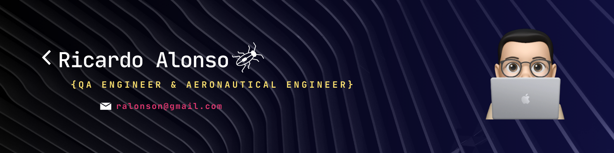

<!-- Banner de portada -->

  

<!-- Botón de LinkedIn con hipervínculo al perfil-->

  

<!-- Contador de visitas al perfil -->

  

<!-- Encabezado saludo -->
<h1>
  Hi, I´m Ricardo. Nice to meet you!
  
</h1>

<!-- About me -->
 

###    About me:  

* 🚀 I'm passionate about technology, constantly exploring new tools and frameworks to stay ahead of the curve.

* 🐛 I'm skilled at identifying and resolving bugs, ensuring high-quality software. My meticulous approach to testing helps prevent bugs and deliver a smooth user experience. 

* 🤖 I'm always seeking new ways to automate tasks and streamline processes, making life easier for myself and my team.

* 🎓 Fresh graduate with a bootcamp in QA Engineering, equipped with the latest testing methodologies and tools.

* 📚 Committed to continuous learning and staying updated with emerging technologies and industry trends.

* 📫 Interested in collaborating or discussing opportunities? Connect with me on [LinkedIn](https://www.linkedin.com/in/ricardoalonson/)!

<!-- Skills -->
## Skills
<!-- Skills como logos -->

<!-- Skills como íconos -->

	<code></code>
	<code></code>

 

<!-- Skills como badges -->

<!-- Statics -->
## Statistics
<!-- Se puede modificar el tema -->

    
    

